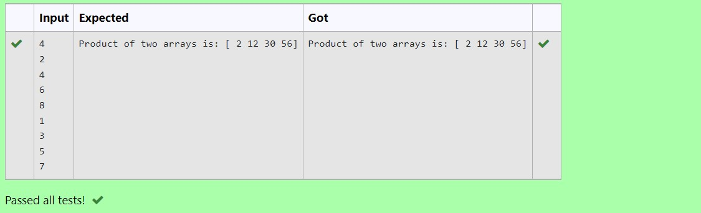

# Multiplying-two-matrix

## AIM:
To write a python program for Multiplying two matrix.

## ALGORITHM:

### Step 1:
import numpy as np.
### Step 2:
Ask inputs from the user.
### Step 3:
Use range function.
### Step 4:
Multiply the matrices
### Step 5:
Run the program .
## PROGRAM: 
~~~
## NAME:R.SOMEASVAR
## REF:NO:21500795
import numpy as np
l1,l2=[],[]
n=int(input())
for i in range(n):
    l1.append(int(input()))
for i in range(n):
    l2.append(int(input()))
value1=np.array(l1)
value2=np.array(l2)
result=value1*value2
print("Product of two arrays is:",result)
~~~

## OUTPUT:

## RESULT:
A python program for Multiplying two matrix has been created.

